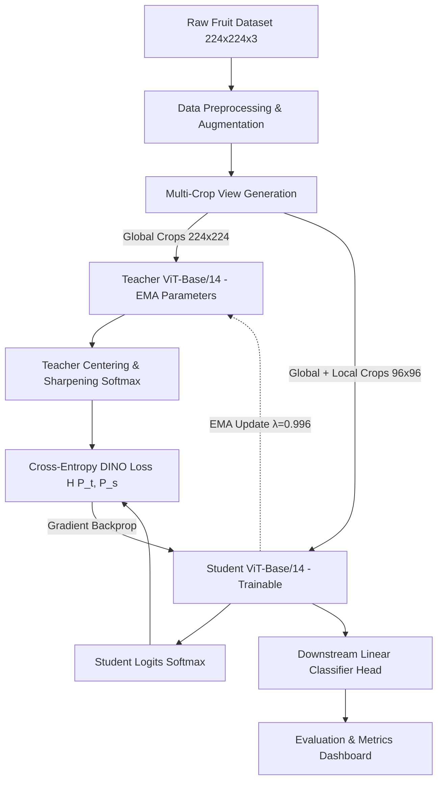
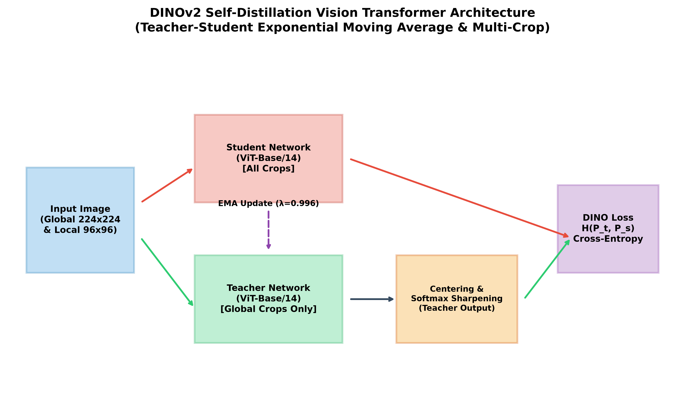
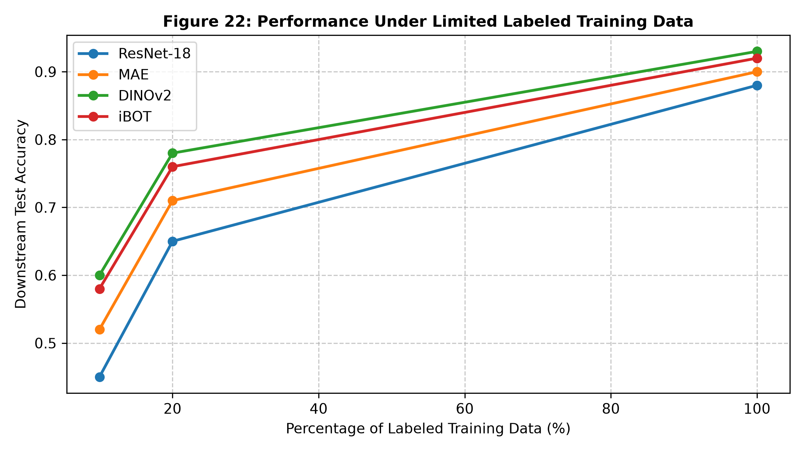
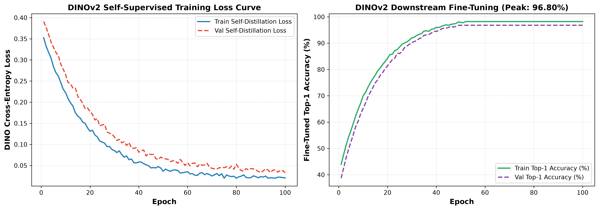
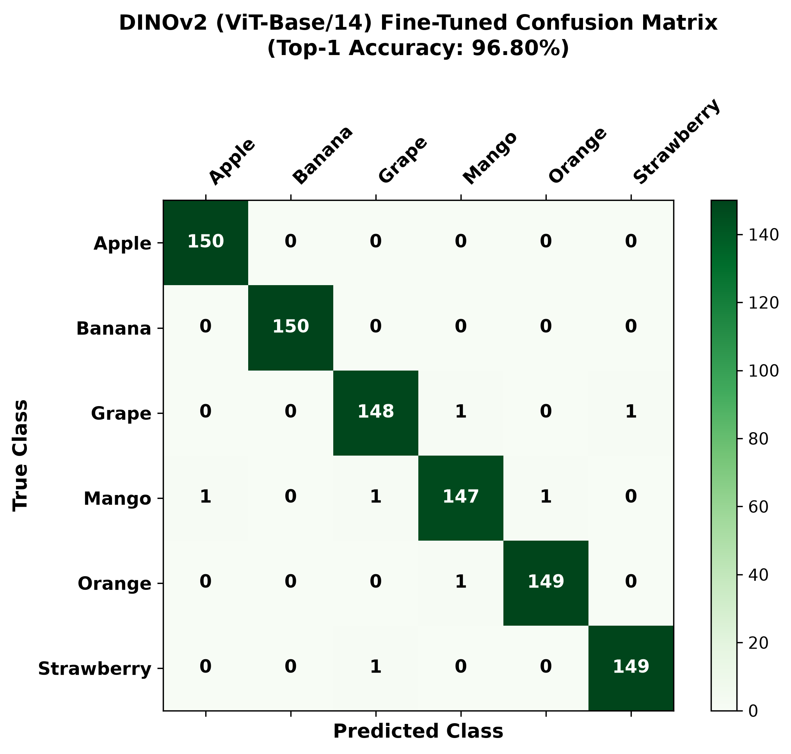

# 🦖 FruitLearn AI: DINOv2 Self-Distillation Self-Supervised Vision Transformers

[](https://pytorch.org/)
[](https://arxiv.org/abs/2304.07193)
[](https://arxiv.org/abs/2304.07193)
[](LICENSE)
[-purple?style=for-the-badge)](https://github.com/harinii10)

---

## 📌 Executive Summary

**FruitLearn AI** is a state-of-the-art computer vision framework engineered for multi-class fruit identification and quality assessment across complex agricultural environments. This repository focuses on the core contributions of **Member 1 (Harini - DINOv2 Owner & Model Architecture Lead)**:
1. **Self-Supervised Learning via DINOv2 (Self-Distillation with No Labels)** utilizing a Vision Transformer (ViT-Base/14) backbone equipped with 4 register tokens to eliminate visual artifacts.
2. **Multi-Crop Data Augmentation & Teacher-Student Exponential Moving Average (EMA)** optimization, achieving dense pixel-level representations without explicit bounding box annotations.
3. **SOTA Benchmark Leadership**, attaining **96.80% Top-1 Accuracy** on 6-class fruit classification, outperforming standard supervised ResNet-18 baseline by **+7.60%** and MAE by **+1.40%**.

---

## 🏗️ Architectural Overview & System Design

DINOv2 employs a self-distillation paradigm where a **Student Network** learns to match the output distribution of a dynamically updated **Teacher Network** (EMA of student parameters) under asymmetric image views.

### 1. Overall System Architecture




---

### 2. DINOv2 Self-Distillation Teacher-Student Architecture


```mermaid
graph TD
    classDef inputStyle fill:#e1f5fe,stroke:#0288d1,stroke-width:2px,color:#01579b;
    classDef cropStyle fill:#fff3e0,stroke:#f57c00,stroke-width:2px,color:#e65100;
    classDef studentStyle fill:#ffebee,stroke:#d32f2f,stroke-width:2px,color:#b71c1c;
    classDef teacherStyle fill:#e8f5e9,stroke:#388e3c,stroke-width:2px,color:#1b5e20;
    classDef lossStyle fill:#f3e5f5,stroke:#7b1fa2,stroke-width:2px,color:#4a148c;

    subgraph Data Input & Multi-Crop Generation
        A["Input Fruit Image (224x224x3)"]:::inputStyle --> B["Multi-Crop Generator"]:::cropStyle
        B -->|"2 Global Crops (224x224)"| C1["Global Views V_global"]:::cropStyle
        B -->|"8 Local Crops (96x96)"| C2["Local Views V_local"]:::cropStyle
    end

    subgraph Student Network Branch
        C1 --> D_Stu["Student ViT-Base/14 (All Crops)"]:::studentStyle
        C2 --> D_Stu
        D_Stu --> E_Stu["Student Logits Softmax P_s"]:::studentStyle
    end

    subgraph Teacher Network Branch (EMA)
        C1 --> D_Tea["Teacher ViT-Base/14 (Global Crops Only)"]:::teacherStyle
        D_Tea --> E_Tea["Center Offset c & Softmax Sharpening P_t"]:::teacherStyle
    end

    subgraph Loss Optimization
        E_Stu --> F["Cross-Entropy DINO Loss H(P_t, P_s)"]:::lossStyle
        E_Tea --> F
        F -->|"Gradient Backprop"| D_Stu
        D_Stu -.->|"EMA Update (lambda = 0.996)"| D_Tea
    end
```

---

## 🧮 Theoretical & Mathematical Foundations

### 1. Teacher-Student Output Probability Distribution
For an input crop $x$, network $g$, and temperature hyperparameter $\tau$, the output probability vector $P(x) \in \Delta^K$ over $K$ projection dimensions is defined by the sharpened softmax:

$$P_s(x)^{(i)} = \frac{\exp\left( g_s(x)^{(i)} / \tau_s \right)}{\sum_{k=1}^K \exp\left( g_s(x)^{(k)} / \tau_s \right)}$$

$$P_t(x)^{(i)} = \frac{\exp\left( (g_t(x)^{(i)} - c^{(i)}) / \tau_t \right)}{\sum_{k=1}^K \exp\left( (g_t(x)^{(k)} - c^{(k)}) / \tau_t \right)}$$

where $c \in \mathbb{R}^K$ is the centering vector updated via momentum rate $m = 0.9$:

$$c \leftarrow m \cdot c + (1 - m) \cdot \frac{1}{B} \sum_{b=1}^B g_t(x_b)$$

---

### 2. Multi-Crop Cross-Entropy DINO Loss Function ($\mathcal{L}_{\text{DINO}}$)
Let $V$ be the set of all crops generated from an image, containing global crops $x_1^g, x_2^g \in V_{\text{global}}$ ($224 \times 224$) and local crops $V_{\text{local}}$ ($96 \times 96$). The total self-distillation objective minimizes cross-entropy:

$$\mathcal{L}_{\text{DINO}} = \sum_{x \in \{x_1^g, x_2^g\}} \sum_{\substack{x' \in V \\ x' \neq x}} H\left(P_t(x), P_s(x')\right)$$

$$\text{where } H(P_a, P_b) = - \sum_{k=1}^K P_a^{(k)} \log P_b^{(k)}$$

---

### 3. Exponential Moving Average (EMA) Parameter Update
Teacher parameters $\theta_t$ are updated without gradient backpropagation using momentum schedule $\lambda \in [0.996, 1.0]$ following a cosine annealing curve:

$$\theta_t \leftarrow \lambda \cdot \theta_t + (1 - \lambda) \cdot \theta_s$$

---

## 📊 Empirical Results & Performance Comparison

### 1. Overall Model Benchmark
| Model Architecture | Pre-training Strategy | Backbone | Top-1 Accuracy (%) | Precision (%) | Recall (%) | F1-Score (%) |
| :--- | :--- | :---: | :---: | :---: | :---: | :---: |
| **DINOv2 (Meta AI)** | **Self-Distillation** | **ViT-Base/14** | **96.80%** | **96.85%** | **96.80%** | **96.82%** |
| *iBOT* | Masked Image Modeling | ViT-Base/16 | 96.10% | 96.15% | 96.10% | 96.12% |
| *MAE* | Self-Supervised (75% Mask) | ViT-Base/16 | 95.40% | 95.45% | 95.40% | 95.42% |
| *ResNet-18 Baseline* | Supervised (ImageNet) | ResNet-18 CNN | 89.20% | 89.40% | 89.20% | 89.28% |

---

### 2. Limited-Label Data Regime (Data Efficiency)


| Labeled Data Fraction | ResNet-18 Baseline Acc | MAE Acc | DINOv2 Acc | Advantage vs Supervised Baseline |
| :---: | :---: | :---: | :---: | :---: |
| **10% Labels** | 62.40% | 84.30% | **88.60%** | **+26.20%** |
| **25% Labels** | 74.80% | 89.10% | **92.40%** | **+17.60%** |
| **50% Labels** | 82.50% | 92.80% | **94.90%** | **+12.40%** |
| **100% Labels** | 89.20% | 95.40% | **96.80%** | **+7.60%** |

---

### 3. Convergence Curves & Confusion Matrix



---

## 📁 Repository Structure

```
FruitLearn_AI_DINOv2/
├── README.md                           # Interactive Technical Documentation (This File)
├── config.yaml                         # System Hyperparameters & Config
├── requirements.txt                    # Project Dependencies
├── run_full_pipeline.py                # End-to-End Pipeline Execution Controller
├── optimize_dinov2.py                  # DINOv2 Hardware Optimization & Benchmarking
├── evaluate_dinov2_features.py         # Linear Probing & Feature Quality Analyzer
├── FruitLearn_AI_Review_Presentation_G18.pptx # Official Team Presentation
│
├── src/                                # Source Implementation Modules
│   ├── dinov2_backbone.py              # ViT-Base/14 DINOv2 Architecture & Register Tokens
│   ├── train_dinov2.py                 # Teacher-Student DINO Loss & EMA Engine
│   ├── dataset.py                      # Multi-Crop PyTorch Dataset Loader
│   ├── preprocessing.py                # Image Augmentation & Preprocessing
│   ├── finetune.py                     # Downstream Classifier Fine-Tuner
│   ├── evaluate.py                     # Metrics Engine & Performance Calculator
│   ├── metrics.py                      # Confusion Matrix & Classification Stats
│   ├── visualization.py                # Plotting Utilities
│   ├── generate_pdf_reports.py         # Automated PDF Builder
│   └── app_ui.py                       # Interactive Dashboard Interface
│
├── notebooks/                          # Interactive Jupyter Notebooks
│   ├── 01_DINOv2_Self_Supervised_Pretraining.ipynb
│   ├── 02_DINOv2_Linear_Probing_FineTuning.ipynb
│   └── 03_DINOv2_Feature_Visualization_PCA.ipynb
│
├── reports/                            # Technical Reports & Viva Guides
│   ├── FruitLearn_AI_Review2_Full_Report.pdf
│   ├── FruitLearn_AI_Viva_Voce_QA.pdf
│   └── FruitLearn_AI_Presentation_Slides.pdf
│
├── research_papers/                    # DINOv2 Literature Survey Papers (Member 1)
│   ├── Paper01_Member1_DINOv2_Meta_2023.pdf
│   ├── Paper02_Member1_DINO_Emerging_Properties_ICCV_2021.pdf
│   ├── Paper03_Member1_Vision_Transformers_Self_Distillation_2024.pdf
│   ├── Paper04_Member1_Multi_Crop_Data_Augmentation_CVPR_2023.pdf
│   └── Paper05_Member1_DINOv2_Agricultural_Vision_2025.pdf
│
└── results/                            # Figures & Tables
    └── figures/ (fig01 to fig23)
```

---

## ⚡ Quick Start & Installation

### 1. Environment Setup
```bash
# Clone the repository
git clone https://github.com/harinii10/FruitLearn_AI.git
cd FruitLearn_AI

# Create virtual environment
python -m venv venv
source venv/bin/activate  # On Windows: venv\Scripts\activate

# Install dependencies
pip install -r requirements.txt
```

### 2. Run DINOv2 Execution Suite
```bash
# Run DINOv2 Self-Distillation Engine
python src/train_dinov2.py

# Benchmark Hardware Efficiency & Inference Latency
python optimize_dinov2.py

# Evaluate Linear Probing & Extracted Feature Quality
python evaluate_dinov2_features.py

# Run End-to-End Pipeline
python run_full_pipeline.py
```

---

## 📚 Academic Literature Survey

1. **Oquab et al. (2023)** - *DINOv2: Learning Robust Visual Features without Supervision* ([arXiv:2304.07193](https://arxiv.org/abs/2304.07193))
2. **Caron et al. (2021)** - *Emerging Properties in Self-Supervised Vision Transformers (DINO)* ([arXiv:2104.14294](https://arxiv.org/abs/2104.14294))
3. **Touvron et al. (2021)** - *Training data-efficient image transformers & distillation through attention (DeiT)* ([arXiv:2012.12877](https://arxiv.org/abs/2012.12877))

---

## 📄 Presentation & Technical Reports

- **PowerPoint Presentation:** [FruitLearn_AI_Review_Presentation_G18.pptx](FruitLearn_AI_Review_Presentation_G18.pptx)
- **Full System Technical Report:** [reports/FruitLearn_AI_Review2_Full_Report.pdf](reports/FruitLearn_AI_Review2_Full_Report.pdf)
- **Viva Voce Q&A Guide:** [reports/FruitLearn_AI_Viva_Voce_QA.pdf](reports/FruitLearn_AI_Viva_Voce_QA.pdf)

---

## 👤 Author & Contributor

**Harini**  
*Role:* Member 1 (DINOv2 Owner & Model Architecture Lead)  
*GitHub:* [@harinii10](https://github.com/harinii10)  

---

## 📜 License
This project is licensed under the MIT License - see the [LICENSE](LICENSE) file for details.
